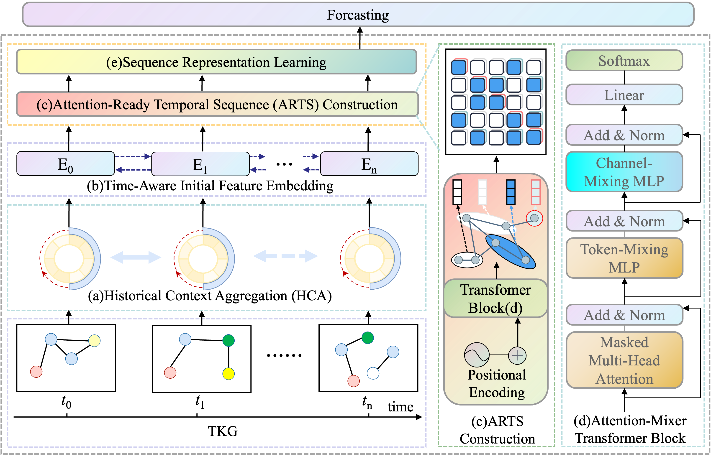

# Reasoning Along Temporal Paths: A Hybrid Transformer Architecture for Temporal Knowledge Graph Forecasting

Temporal knowledge graph (TKG) forecasting aims to predict future facts based on historical temporal information and still faces key challenges such as event sparsity and complex long-term dependencies. While graph-based methods effectively capture relational structure, they often fail to model nuanced long-range temporal patterns. Alternatively, standard Transformers, while potent for sequence modeling, are fundamentally time-agnostic; their generic positional encodings overlook critical TKG-specific temporal dynamics. As a result, many approaches struggle to capture fine-grained temporal patterns, limiting their effectiveness in forecasting sparse or complex events. To address these limitations, we propose \textbf{HTA} (A \textbf{H}ybrid \textbf{T}ransformer \textbf{A}rchitecture). HTA first constructs a query-specific \textbf{Attention-Ready Temporal Sequence (ARTS)} by aggregating historical context along a multi-hop reasoning path. This atomic sequence is enriched with a novel temporal encoding for fine-grained interval awareness. At its core, HTA employs a stack of hybrid \textbf{Attention-Mixer Transformer Blocks} that synergistically combine self-attention for capturing long-range dependencies with MLP-based layers for efficient feature refinement. Extensive experiments on four diverse benchmarks show that HTA significantly outperforms state-of-the-art methods. Notably, on the sparse and challenging GDELT dataset, HTA achieves an absolute MRR improvement of over 20 points, demonstrating its superior ability to model complex and noisy temporal dynamics.




## Installation

This implementation requires Python 3.8 or higher. We recommend creating a new conda environment for installation.

``` sh
conda create -n hta python=3.8 -y
conda activate hta
cd hta
pip install -e .
```

### Data Preparation

To prepare the dataset for training:

```sh
cd data
python preprocess.py $dataset_name
```

### Training and Evaluation

The configuration files for different experiments are located in the `/config` directory. To start training with a specific configuration:

``` sh
python -m kge start config/icews14-best.yaml
```

The training process will automatically use all available GPUs by default. The evaluation results will be displayed in the log file.

### Resume Training and Testing

To resume training from a checkpoint or evaluate a trained model:

```sh
python -m kge resume ./local/experiments/...
```

The evaluation metrics will be shown in the log file, including MRR, Hits@1, Hits@3, and Hits@10.

# Multi-GPU training configuration(put this in yaml file)
job.multi_gpu: true

job.device: cuda
